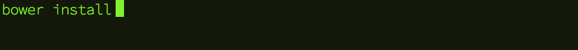

# LearnPress

The most minimal WordPress *theme starter* ever :)

Designed for learning.


# Getting started

### 1. Download it

Download and extract the *zip* for this repository, or `git clone` it, into your `wp-content/themes` folder.

```
YOUR_WORDPRESS_FOLDER
├── wp-content
│   ├── themes
│   │   ├── LearnPress
│   │   ├ ... other themes
```

You want to end up with a `LearnPress` folder inside `wp-content/themes`.

### 2. Activate it

From your WP dashboard, go to `Appearance` > `Themes`.

You should (if you have followed the previous step correctly) see LearnPress among the available themes.


Click `Activate`.

### 3. Install *libraries*

Such as jQuery, HTML5 Boilerplate, Skeleton, Bootstrap etc.

To add a library (say, jQuery) to this project, we would normally do the following:

1. Search for it on the Web 
2. Download the right file(s) 
3. Extract them into the right folder.. 
4. *Rinse and repeat* for each library we may use!


To avoid these repetitive tasks, we can use a tool called [**bower**](http://bower.io/) which will automate the chores for us. [What’s so great about bower?](https://css-tricks.com/whats-great-bower/)

If you haven't installed bower yet, [follow the instructions](#installing-bower) below and then come back here.

1. Open Terminal (Mac) or a [CommandPrompt](http://windows.microsoft.com/en-gb/windows-vista/open-a-command-prompt-window) (Windows). 
* *Navigate* to the `LearnPress` folder  

	* On Mac, drag the `LearnPress` folder onto the Terminal app icon  

	* On Windows, drag the `LearnPress` folder inside CommandPrompt, then change `C:` to `cd`, so that you'll end up with something like `cd  \wamp\www\YOUR_SITE_NAME\wp-content\themes\LearnPress`
* Type in `bower install` and press the `↲` (Enter) key



If all goes well, you should end up with a new `bower_components` folder containing `html5-boilerplate` and `skeleton-css`
	
	```
	LearnPress
	├── bower_components
	│   ├── html5-boilerplate
	│   ├── skeleton-css
	```


Bower will install the **components** listed in `bower.json`.


#### Troubleshooting

* If you're getting a `ECMDERR Failed to execute ...` error:

	`git config --global url."https://".insteadOf git://`
	
* If you're getting a `git is not installed or not in the PATH` error in Windows, follow [these steps](http://stackoverflow.com/questions/20666989/bower-enogit-git-is-not-installed-or-not-in-the-path) 


#### Want more libraries? 

LearnPress comes with HTML5Boilerplate and Skeleton.

Let's say you want to add [Bootstrap](http://getbootstrap.com/getting-started/#download-bower).

`bower install bootstrap --save`

The `--save` bit will add the Bootstrap dependency to your `bower.json`

Check [libraries.io](https://libraries.io/bower/) for even more libraries.


# Installing bower 

Bower is a **command-line tool**, so you'll use the following application, depending on which system you are:

| Mac | Windows | Linux |
| --- | ------- | ----- |
| [Terminal](http://mac.appstorm.net/how-to/utilities-how-to/how-to-use-terminal-the-basics/) | [CommandPrompt](http://windows.microsoft.com/en-gb/windows-vista/open-a-command-prompt-window) | [Terminal](https://help.ubuntu.com/community/UsingTheTerminal) |


Once you've opened Terminal / CP, install a couple of things:

1. Install [Node.JS](https://nodejs.org/)   
	
	To check if you have Node.JS installed..   
	In Terminal / CP, type `npm` and press the `↲` (Enter) key
* Install [bower](http://bower.io/)  

	To check if you have bower installed..   
	Type `bower` and press the `↲` (Enter) key
* If you're on Windows, install [msysgit](https://msysgit.github.io/)


